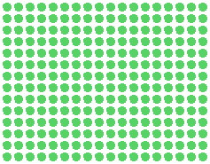

#

# About Me:

- I'm a developer who is passionate about coding and creating crazy, creative projects.
- I'm currently studying and building Node.js projects with **TypeScript** on the back end and **React** projects on the front end.
- I completed a web page development course at **CEDESP**.
- In my free time, I edit some videos.
#

        <picture align="left">
          <source media="(prefers-color-scheme: dark)" srcset="bad-apple.gif" align="left"/>
          <source media="(prefers-color-scheme: light)" srcset="bad-apple-white.gif" align="left" />
          
        </picture>
        

          
          

              
              
              
              
              
              
              
              
              
              
              
              
              
              
              
              
              
          

        

#

  

    
    
    
  

